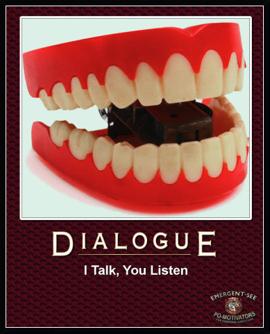
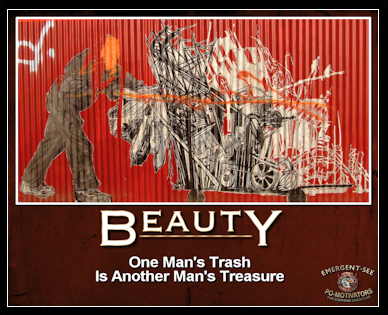
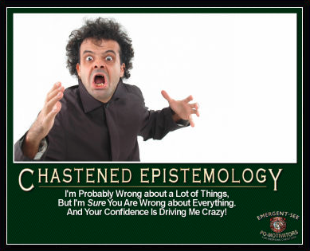
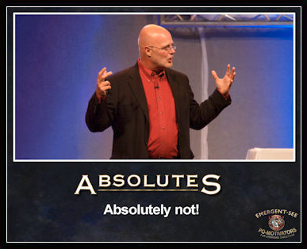

# The Big List
This is the list I wish I'd started ages ago.

(The name is more anticipatory than strictly accurate.)

Please [comment](https://gist.github.com/nqafield/6225e00469eb8fd8925ab18076e06319).

# **Announcement**
I'm thinking the focus of this list should change.

Part of the original premise was that it might be a small help in pointing people in the right direction and perhaps starting a "conversation" (by which I mean, of course, a debate) that perhaps would help some people (primarily myself) learn a few things, mostly about software. Unfortunately I've ~recently discovered~ become increasingly aware that humanity (or, at least, the vast majority of the software community) appears to have completely forgotten how to think and debate. And since I don't trust my own ideas one bit, unless I can back them up with objective rational argument (you know, on account of me not being an arrogant narcissist), then I didn't want to risk misleading naive people into further avenues of nonsense.

It occurs to me that there is perhaps no greater level of arrogance (on an ordinary every-day scale) than someone imagining that their pronouncements on objective matters of fact should be listened to and accepted without challenge - and their challengers silenced. So, naturally, I want to avoid that. But if people really have forgotten how to think (and therefore can't rationally challenge me), then you can see I have a dilemma...

So maybe the first goal of this list should be to attempt to point people in the direction of anything that might re-ignite their desire for the lost art of reason, and then they can hopefully start showing me where I'm wrong.

**NB**: If I have said anything at all - even the tiniest jot or tittle - that is incorrect (either softwarily or otherwise), then please, by all means, come at me. ASAP. I'm here waiting. And you're welcome [here](https://gist.github.com/nqafield/6225e00469eb8fd8925ab18076e06319). I want to be corrected.

In the meantime, watch out for the new list.

## Thoughts
* What I realise I've probably been reacting (so violently) to is the decaying stench of Postmodernism.
* "Postmodernism? Really? Isn't that a bit heavy for software development?"
  * In a sense, this isn't just about software development. But even so, software, in most contexts, is largely about people and their assumptions and attitudes; relationships; communication; etc. And, increasingly, about politics and "activism" rather than just tech. So these things are unavoidable even here.

## Recent reading
Currently: [Explaining Postmodernism - Stephen R. C. Hicks](https://www.amazon.co.uk/Explaining-Postmodernism-Skepticism-Socialism-Rousseau-ebook/dp/B005D53DG0/ref=tmm_kin_swatch_0?_encoding=UTF8&qid=1521377245&sr=8-1)

# The Old List
## TL;DR - Give me a quick taster...
* [Code in the Language of the Domain - Dan North](http://programmer.97things.oreilly.com/wiki/index.php/Code_in_the_Language_of_the_Domain)
* [Seeing Spaces - Bret Victor](https://vimeo.com/97903574)
* [`Badger badger = new Badger()`](https://www.badgerbadgerbadger.com/)[3](#footnote3)
* What can I say? Watch pretty much anything by [Kevlin Henney](https://www.youtube.com/watch?v=1s-BGBA8Nqo)[4](#footnote4)

# Critical few
*This will not be an immutable list.*
* [The Future of Programming - Bret Victor](https://vimeo.com/71278954)
  * Why does it matter?
    * I keep coming back to this talk. It's genius in so many ways.
    * It's a fantastic "conceit", very well presented. (The only[1](#footnote1) thing better - from this point of view - that comes to mind is "Growing a Language". Coincidentally - I assume - both these talks feature acetates and OHPs, but for slightly different reasons.)
  * Inspirational, Fundamental, History
* [How to Write a Method - Kevlin Henney](https://vimeo.com/74316116)
  * Why does it matter?
    * Questions the basics of coding style and posits the idea that style is often not as subjective as we like to think it is.
    * That feeling when you figured you knew this already but had no idea how to explain it or justify it...
    * “It turns out that style matters in programming for the same reason that it matters in writing. It makes for better reading.” - Doug Crockford
  * Provocative

# My current project defaults
*For any project, of any reasonable size, in my current context, this is roughly where I'm coming from...*
* [Clean Architecture and Design - Robert C. Martin](https://vimeo.com/97530863)
  * Currently under serious threat from the C4 Model
* [TDD, where did it all go wrong? - Ian Cooper](https://vimeo.com/68375232)
  * Perhaps tempered by, [The TDD That Works for Me - Yegor Bugayenko](http://www.yegor256.com/2017/03/24/tdd-that-works.html)[2](#footnote2)
  * Also intrigued by Property-Based Testing
* [Why UX is not only the Responsibility of the UX-er - Janne Jul Jensen](https://www.youtube.com/watch?v=Tbu6G08n_Gw)
* [Why I've Come to Prefer Fluent APIs Over Other Kinds of DSLs - John Slaby](https://www.infoq.com/presentations/dsl-fluent-api)

# Welcome to my project - here's what you need to know
* [You should question everything (even this statement, even this list)](https://vimeo.com/105758303)
* [The "obvious", brute-force approach to solving problems stops working for any reasonably-sized codebase](https://www.teamten.com/lawrence/writings/norris-numbers.html)

# Real OO?
*The idea that there is a genuine concept of Object Oriented Programming out there somewhere - which most of us have missed - is intriguing and sometimes infuriating. Enjoy!*
* [Seven Virtues of a Good Object - Yegor Bugayenko](http://www.yegor256.com/2014/11/20/seven-virtues-of-good-object.html)
* [A Taste of Trygve - James Coplien](https://www.youtube.com/watch?v=pjd0IB_8xD8)
* [OOP: You’re Doing It Completely Wrong (Stir Trek Edition) - Kevin Berridge](https://vimeo.com/91672848)
* Agile Architecture - Allen Holub ([Part 1](https://www.youtube.com/watch?v=0kRCFVGpX7k)[5](#footnote5))

# 97 web things every programmer should know about
* [97 Things Every Programmer Should Know](http://programmer.97things.oreilly.com/wiki/index.php/Contributions_Appearing_in_the_Book)
* [Adobe Kuler](https://color.adobe.com/)

# 97 people every softy should at least have heard about
* [Kevlin Henney](https://about.me/kevlin)
* [Yegor Bugayenko](http://www.yegor256.com/about-me.html)
* [James Marcus Bach](https://twitter.com/jamesmarcusbach?ref_src=twsrc%5Egoogle%7Ctwcamp%5Eserp%7Ctwgr%5Eauthor)
* [Bret Victor](http://worrydream.com/)
* [Dave Ackley](http://www.cs.unm.edu/~ackley/)

# Fiendish forays into functional fields
* [Boundaries - Gary Bernhardt](https://www.destroyallsoftware.com/talks/boundaries)

# If you live a sheltered programming life, ignore these
* [The Problem with Time & Timezones - Tom Scott](https://www.youtube.com/watch?v=-5wpm-gesOY)
* [Working with Time is Easy - Jon Skeet](https://www.youtube.com/watch?v=saeKBuPewcU)
* [Internationalis(z)ing Code - Tom Scott](https://www.youtube.com/watch?v=0j74jcxSunY)

# 80:20 Videos
*80% of the content of these videos seems like a complete waste of time. The 20% is thoroughly intriguing...*
* [The Mess We're In - Joe Armstrong](https://vimeo.com/97408239)

# "Simplify, simplify, simplify." (Henry David Thoreau)
* Dan North thing?
* Herb Sutter?

# Stuff that *apparently* has nothing to do with software
* (What happened to this list?)
* [Politics and the English Language - George Orwell](http://www.orwell.ru/library/essays/politics/english/e_polit/)

# Soft skills (people have told me they matter)
* [Soft Skillz: They Aren't Just For Humans Anymore - Brian H. Prince](https://www.youtube.com/watch?v=4KpYAwHr-3Q)

## Holding area
### Talks
* [Declarative Thinking, Declarative Practice - Kevlin Henney](https://www.youtube.com/watch?v=nrVIlhtoE3Y)
* [Becoming a Software Testing Expert - James Marcus Bach](https://www.youtube.com/watch?v=3FTwaojNkXw)
* [It Is Possible to Do Object-Oriented Programming in Java - Kevlin Henney](https://vimeo.com/56748054)
* [The Most Important Design Guideline - Scott Meyers](https://www.youtube.com/watch?v=5tg1ONG18H8)
* [Introduction to Software Architecture - George Fairbanks](https://www.youtube.com/watch?v=x30DcBfCJRI)
* [Growing a Language - Guy Steele](https://www.youtube.com/watch?v=_ahvzDzKdB0)
* [Clojure: Programming with Hand Tools - Tim Ewald](https://www.youtube.com/watch?v=ShEez0JkOFw)

### Books
* [Software Requirements & Specifications - Michael Jackson](http://c2.com/cgi/wiki?SoftwareRequirementsAndSpecifications)

### Papers
* [Statecharts: A Visual Formalism for Complex Systems - David Harel](http://www.wisdom.weizmann.ac.il/~dharel/SCANNED.PAPERS/Statecharts.pdf) ([archive](https://web.archive.org/web/20180110002234/http://www.wisdom.weizmann.ac.il/~dharel/SCANNED.PAPERS/Statecharts.pdf))
* [Go To Statement Considered Harmful - Edsger Dijkstra](http://homepages.cwi.nl/~storm/teaching/reader/Dijkstra68.pdf)
* [The Mythical Man-Month - Fred Brooks](https://www.cs.virginia.edu/~evans/greatworks/mythical.pdf)
* [Chicken Chicken Chicken: Chicken Chicken - Doug Zongker](http://valbonne-consulting.com/papers/classic/chicken.pdf)
* [Out of the Tar Pit - Ben Moseley & Peter Marks](http://shaffner.us/cs/papers/tarpit.pdf)
* [A Design Methodology for Reliable Software Systems - B.H. Liskov](http://valbonne-consulting.com/papers/classic/Liskov_72-Design_Methodology_for_Reliable_Software_Systems.pdf)
* [Reflections on Trusting Trust - Ken Thompson](https://www.ece.cmu.edu/~ganger/712.fall02/papers/p761-thompson.pdf)
* [No Silver Bullet - Fred Brooks](http://worrydream.com/refs/Brooks-NoSilverBullet.pdf)
* [On the Criteria To Be Used in Decomposing Systems into Modules - D.L. Parnas](https://www.cs.umd.edu/class/spring2003/cmsc838p/Design/criteria.pdf)
* [An Introduction to Software Architecture - David Garlan and Mary Shaw](https://www.cs.cmu.edu/afs/cs/project/vit/ftp/pdf/intro_softarch.pdf)
* [Big Ball of Mud - Brian Foote and Joseph Yoder](http://www.laputan.org/pub/foote/mud.pdf)
* [Architectural Styles and the Design of Network-based Software Architectures - Roy Thomas Fielding](https://www.ics.uci.edu/~fielding/pubs/dissertation/fielding_dissertation.pdf)
* [The UNIX TimeSharing System - Dennis M. Ritchie and Ken Thompson](http://www.cs.berkeley.edu/~brewer/cs262/unix.pdf)
* [The Architecture of Complexity - Herbert A. Simon](http://www2.econ.iastate.edu/tesfatsi/ArchitectureOfComplexity.HSimon1962.pdf)
* [A Mathematical Theory of Communication - C. E. Shannon](http://worrydream.com/refs/Shannon%20-%20A%20Mathematical%20Theory%20of%20Communication.pdf)
* [Managing the Development of Large Software Systems - Dr. Winston W. Royce](https://www.cs.umd.edu/class/spring2003/cmsc838p/Process/waterfall.pdf)
* [The Original MVC Reports - Trygve Reenskaug](https://heim.ifi.uio.no/~trygver/2007/MVC_Originals.pdf)
* [The Rise of Worse is Better - Richard P. Gabriel](http://dreamsongs.com/RiseOfWorseIsBetter.html)
* [Working With Objects — In Computer and Mind - Trygve & Cope](http://folk.uio.no/trygver/2015/CommSense-1.14.1.pdf)
* Meta:
  * [Seminal Papers in Software Engineering: The Carnegie Mellon Canonical Collection](http://repository.cmu.edu/cgi/viewcontent.cgi?article=2038&context=isr)
  * [An incomplete list of classic papers every Software Architect should read](https://blog.valbonne-consulting.com/2014/06/09/an-incomplete-list-of-classic-papers-every-software-architect-should-read/)
  * [Theoretical Computer Science - What papers should everyone read?](https://cstheory.stackexchange.com/questions/1168/what-papers-should-everyone-read)

### Classics (in some way or other) that I haven't actually read or watched (properly) yet
* [Null References: The Billion Dollar Mistake - Tony Hoare](https://www.infoq.com/presentations/Null-References-The-Billion-Dollar-Mistake-Tony-Hoare)
* [The Mother of All Demos - Douglas Engelbart](https://www.dougengelbart.org/firsts/1968-demo-interactive.html) ([archive](https://web.archive.org/web/20180202063557/https://www.dougengelbart.org/firsts/1968-demo-interactive.html)) ([tl;dw](https://www.youtube.com/playlist?list=PLCGFadV4FqU2yAqCzKaxnKKXgnJBUrKTE))

### These folks are onto something but I might need to watch again to know what to do about it
* [If Considered Harmful: How to eradicate 95% of all your bugs in one simple step - Jules May](https://www.youtube.com/watch?v=z43bmaMwagI)

<a id="footnote1">1</a> I'm reminded that while Bret Victor's talk is from the past (in more ways than one) there is also [this talk](https://www.destroyallsoftware.com/talks/the-birth-and-death-of-javascript) which, at the time of writing, is still from the future. [↩](#super1)

<a id="footnote2">2</a> But with [this caveat](http://www.yegor256.com/2017/03/24/tdd-that-works.html#comment-3238249519). [↩](#super2)

<a id="footnote3">3</a> https://twitter.com/munificentbob/status/675769424410902528. [↩](#super3)

<a id="footnote4">4</a> The only thing I dislike about Kevlin (and *dislike* is too strong a word, even here) is his occasional cheap-shots on political matters. Everything else is sheer class.  [↩](#super4)

<a id="footnote5">5</a> Anyone who bothers to watch this, and hears about Daniel Kahneman's facinating book, should also read [this](https://replicationindex.wordpress.com/2017/02/02/reconstruction-of-a-train-wreck-how-priming-research-went-of-the-rails/comment-page-1/#comment-1454) noble[6](#footnote6) comment. [↩](#super5)

<a id="footnote6">6</a> Although, it's a shame (and somewhat a sign of the times) that someone admitting that they got something wrong should be considered "noble". [↩](#super6)

